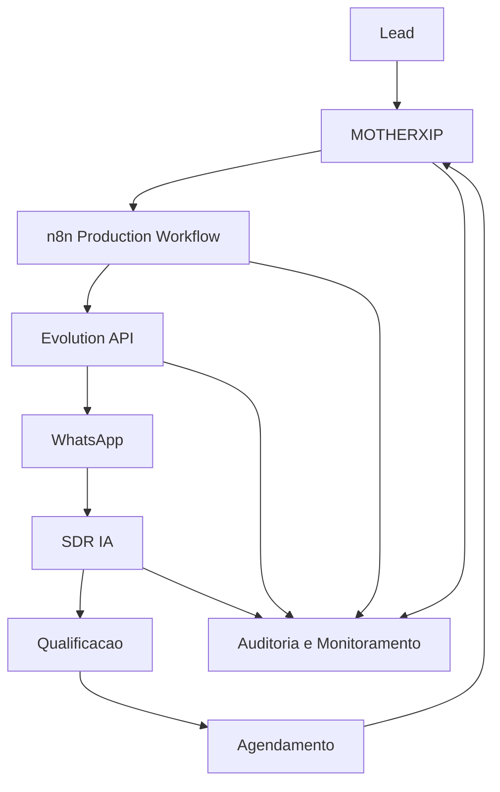

# PRODUCTION OUTREACH ARCHITECTURE

Status: blueprint tecnico. Producao nao ativada.

## Fluxo Alvo

## Separacao Sandbox vs Production

- Sandbox continua usando workflows e providers de homologacao.
- Production deve usar workflow n8n separado, credenciais separadas e instance Evolution separada.
- Production nao reutiliza workflow sandbox.
- Provider real permanece desligado ate aprovacao explicita.

## Estados

- `queued`
- `sent`
- `delivered`
- `read`
- `replied`
- `meeting_scheduled`
- `failed`
- `paused`
- `stopped`
- `opt_out`

## Eventos

- `outreach_queued`
- `message_sent`
- `message_delivered`
- `message_read`
- `lead_replied`
- `opt_out_detected`
- `meeting_scheduled`
- `retry_scheduled`
- `dead_letter_created`
- `webhook_invalid`

## Falhas

- Webhook invalido.
- Evolution offline.
- Telefone invalido.
- Rate limit excedido.
- Lead em opt-out.
- Retry excedido.
- Payload invalido.
- Lead travado acima de 72h.

## Retry

- Callback: 3 tentativas.
- Evolution: 3 tentativas.
- Webhook: 3 tentativas.
- Backoff: 30s, 60s, 120s.
- Ao exceder: `dead_letter`.

## Opt-Out

Mensagens detectadas:

- `pare`
- `parar`
- `nao tenho interesse`
- `não tenho interesse`
- `remover`
- `cancelar`
- `stop`
- `unsubscribe`

Ao detectar:

- status passa para `opt_out`;
- envio futuro e bloqueado;
- evento e registrado;
- auditoria e registrada;
- nova mensagem nao deve ser enviada.

## Escala e Rate Limit

- Mensagens por hora configuraveis.
- Mensagens por dia configuraveis.
- Delay aleatorio entre 30s e 180s.
- Janela comercial padrao: 08:00 as 18:00.
- Fora da janela: fila, sem envio.

## Dead Letter

Tabela preparada: `outreach_dead_letters`.

Campos:

- `payload`
- `error`
- `source`
- `attempt`
- `created_at`

Migration preparada, nao aplicada: `supabase/migrations/20260613090000_sprint_21_outreach_dead_letters.sql`.

## Monitoramento

Outreach Center deve exibir:

- Ambiente Sandbox/Production.
- Fila.
- Falhas.
- Retries.
- Dead Letters.
- Opt-Outs.
- Evolution status, latencia e heartbeat.
- SDR: conversas ativas, pausadas, aguardando resposta e reunioes marcadas.

## Alertas Operacionais

Infraestrutura local preparada para:

- webhook invalido;
- Evolution offline;
- retry excedido;
- dead letter criado;
- lead travado >72h.

Sem Slack, Telegram ou outro canal externo nesta sprint.
